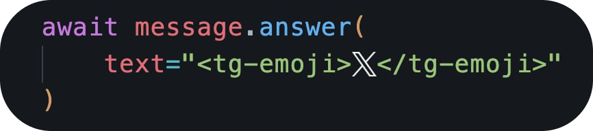
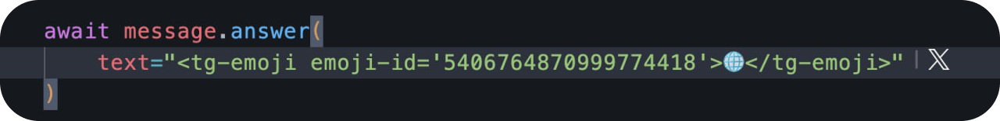
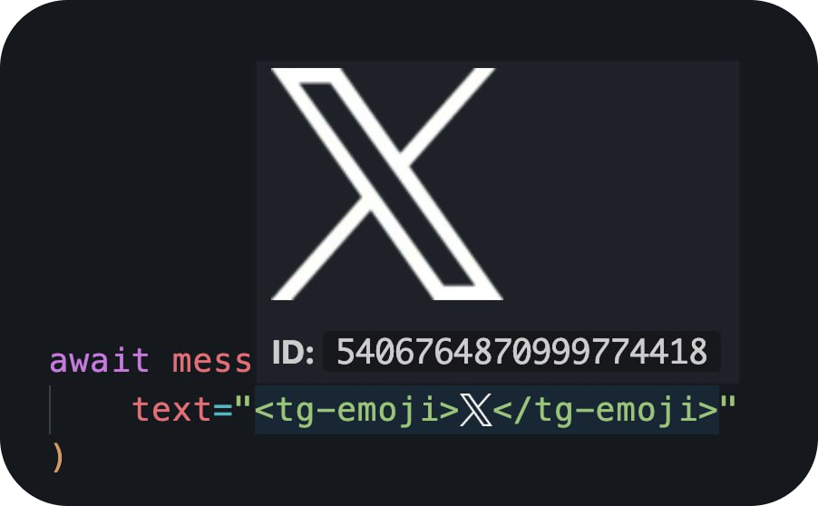

# Telegram Emoji

VS Code extension that renders Telegram premium custom emojis inline, right in your editor.

Detects `<tg-emoji emoji-id='...'>` tags and displays the actual custom emoji image fetched from the Telegram Bot API.

### Collapsed



### Expanded



### Hover preview



## Requirements

This extension requires a **Telegram Bot API token** to fetch custom emoji images.

### How to get a Bot Token

1. Open Telegram and find [@BotFather](https://t.me/BotFather)
2. Send `/newbot` and follow the prompts (choose a name and username)
3. BotFather will reply with a token like `123456789:ABCdefGHIjklMNOpqrsTUVwxyz`
4. Copy the token

### Configure the extension

Open VS Code settings (`Ctrl+,`) and search for `Telegram Emoji`, then paste the token into **Bot Token** field.

Or add to `settings.json`:

```json
{
  "telegramEmoji.botToken": "YOUR_BOT_TOKEN_HERE"
}
```

## Settings

| Setting | Default | Description |
|---|---|---|
| `telegramEmoji.botToken` | `None` | Telegram Bot API token |
| `telegramEmoji.enableInline` | `true` | Show inline emoji preview |

## License

MIT
